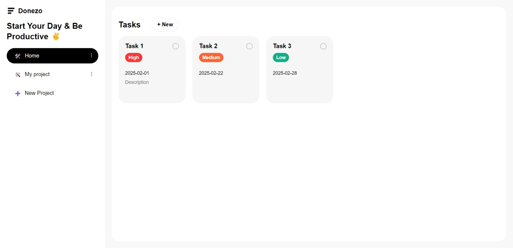

# To-Do List Project

This is a **To-Do List** application built as part of [The Odin Project](https://www.theodinproject.com/) JavaScript curriculum. The project focuses on using **JavaScript modules**, **Webpack**, and **localStorage** to create a fully functional task management app.

## Features

- **Add, Edit, and Delete Tasks**: Users can manage their to-do items dynamically.
- **Project Organization**: Tasks can be categorized under different projects.
- **Task Details**: Each task can have a title, description, due date, and priority level.
- **Local Storage Persistence**: Tasks and projects are saved even after refreshing the page.
- **Modular Code Structure**: Uses JavaScript ES6 modules for maintainability.
- **Responsive Design**: Works on both desktop and mobile screens.

## Project Preview



Try the live version of the project here: [Live Preview](https://gonalgar.github.io/to-do-list/)  

## Technologies Used

- **HTML5**: Markup for structuring the app.
- **CSS3**: Styling for a clean and intuitive UI.
- **JavaScript (ES6)**: Handles task creation, editing, and deletion.
- **Webpack**: Bundles JavaScript modules for better performance.
- **localStorage**: Saves user data for persistence.

## Getting Started

To view or modify the project locally:

1. Clone this repository:
   ```bash
   git clone https://github.com/gonalgar/to-do-list.git
2. Navigate to the project directory:
   ```bash
    cd todo-list
3. Install the necessary dependencies:
    ```bash
    npm install
4. Build the project using Webpack:
   ```bash
   npm run build
5. Open the dist/index.html file in your browser to use the app.

## What I Learned
- Implementing localStorage to persist user data across sessions.
- Structuring JavaScript code using ES6 modules for better maintainability.
- Using Webpack to bundle and optimize project files.
- Creating an interactive UI with event listeners and DOM manipulation.
- Organizing data with objects and arrays for task management.

## Acknowledgements
This project is part of [The Odin Project Intermediate JavaScript](https://www.theodinproject.com/paths/full-stack-javascript/courses/javascript) curriculum. It provided hands-on experience in structuring JavaScript applications and managing state with localStorage.

## License
This project is open-source and available under the MIT License.